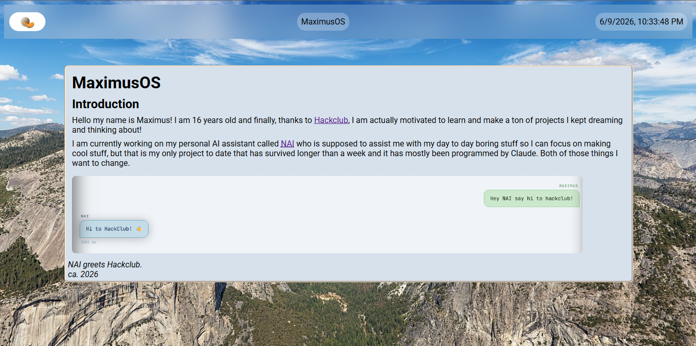

# MaximusOS — A personal webOS intro page built to introduce me: Maximus!

## What it does

A browser-based "OS" themed intro page where I introduce myself.

## Features

- Introduces me
- Introduces [NAI](https://nai.maximushub.net), my personal AI assistant.
- Covers my non-existent hobbies and the massive list of things I want to learn
- Background image with a centered content card
- Taskbar with a cantaloupe, title, and a live clock

## How It Works

HTML, CSS, and a tiny bit of JavaScript for the live clock.

## Credits

- [Hack Club](https://hackclub.com/) for actually getting me motivated to build things
